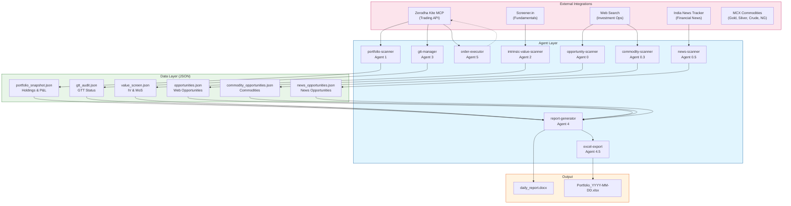
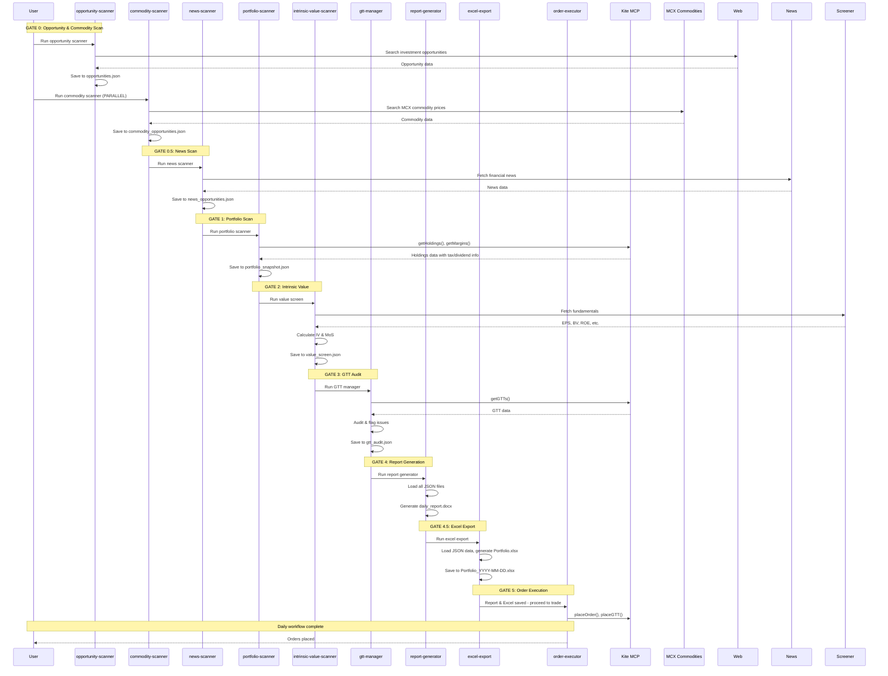
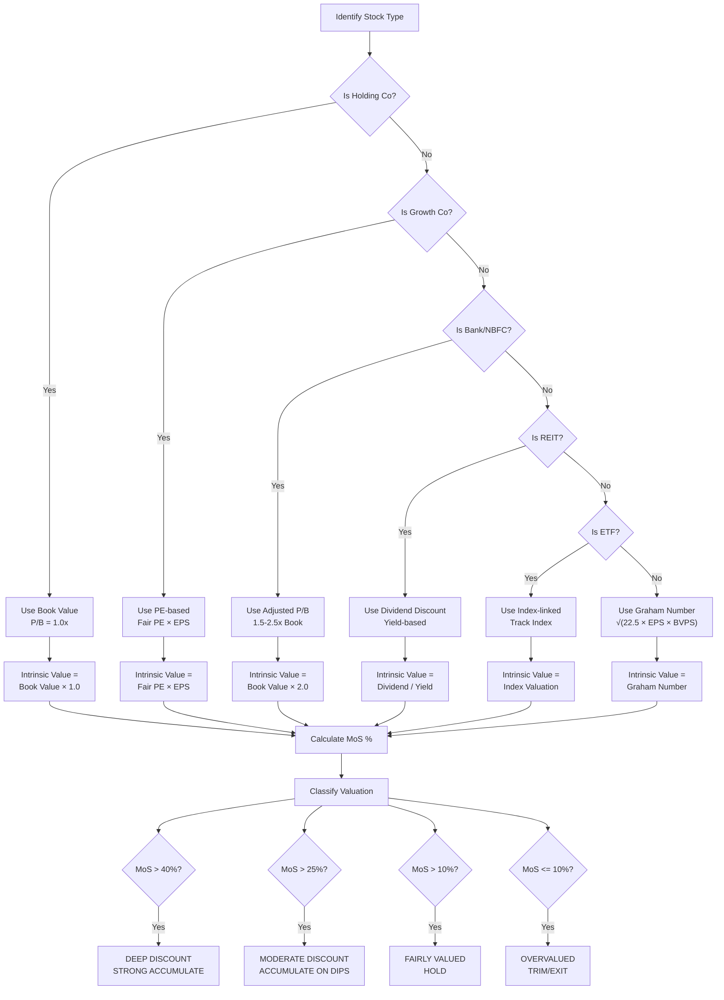
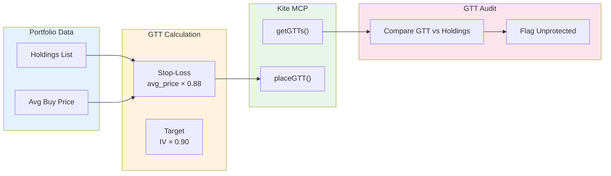
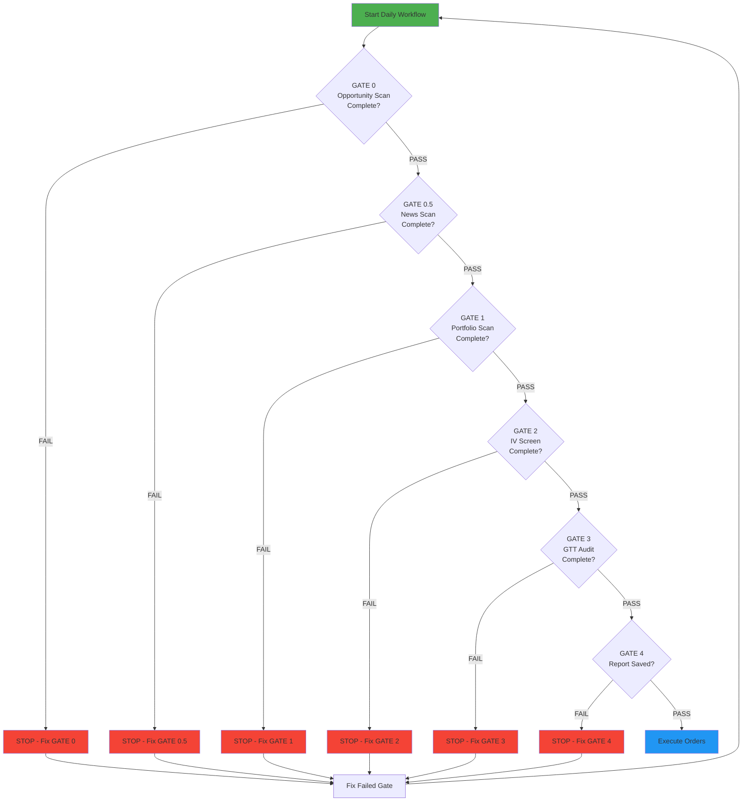
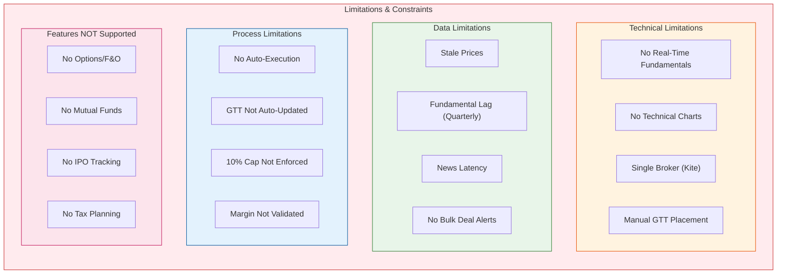

# KiteMCP Architecture Diagram (Mermaid)

## System Architecture

---

## Daily Workflow Sequence

---

## Data Flow Architecture

```mermaid
flowchart LR
    subgraph Input["Inputs"]
        Web["Web Search"]
        News["Financial News"]
        Kite["Kite Holdings"]
        Screener["Screener Data"]
    end

    subgraph Processing["Processing"]
        Agents["7 Agents<br/>Execute in Sequence"]
    end

    subgraph Storage["Storage Layer"]
        JSON1["opportunities.json"]
        JSON2["news_opportunities.json"]
        JSON3["portfolio_snapshot.json"]
        JSON4["value_screen.json"]
        JSON5["gtt_audit.json"]
    end

    subgraph Output["Output"]
        DOCX["daily_report.docx"]
    end

    Input --> Agents
    Agents --> Storage
    Storage --> DOCX
```

---

## Agent Responsibility Matrix

```mermaid
gantt
    title Daily Agent Schedule (08:30 - 09:30 IST)
    dateFormat HH:mm
    
    section GROUP 1: External Data
    opportunity-scanner      :a1, 08:30, 10m
    commodity-scanner       :a2, 08:30, 10m
    news-scanner            :a3, 08:40, 10m
    
    section GROUP 2: Portfolio & Analysis
    portfolio-scanner       :a4, 08:50, 10m
    intrinsic-value-scanner :a5, 09:00, 5m
    gtt-manager            :a6, 09:05, 5m
    
    section GROUP 3: Output & Execution
    report-generator        :a7, 09:10, 5m
    excel-export           :a8, 09:15, 5m
    order-executor         :a9, 09:20, 10m
```

---

## Valuation Methods by Stock Type

---

## GTT Protection Workflow

---

## Report Generation Pipeline

```mermaid
flowchart TB
    subgraph Sources["JSON Data Sources"]
        S1["portfolio_snapshot.json<br/>Holdings & P&L"]
        S2["value_screen.json<br/>IV & MoS"]
        S3["gtt_audit.json<br/>GTT Status"]
        S4["opportunities.json<br/>Web Opportunities"]
        S5["news_opportunities.json<br/>News Opportunities"]
        S6["commodity_opportunities.json<br/>Commodities"]
    end

    subgraph Logic["Generate Actions"]
        L1["Extract Unprotected<br/>Holdings"]
        L2["Extract Deep Discount<br/>Stocks (MoS>40%)"]
        L3["Extract Overvalued<br/>Stocks"]
        L4["Extract Tax-Loss<br/>Candidates (>10%)"]
    end

    subgraph Report["Report Sections"]
        R1["Section 1: Immediate Actions"]
        R2["Section 2: Portfolio Summary"]
        R3["Section 3: Holdings Table"]
        R4["Section 4: Deep Discount"]
        R5["Section 5: Overvalued"]
        R6["Section 6: GTT Status"]
        R7["Section 7: Web Opportunities"]
        R8["Section 8: News Opportunities"]
        R9["Section 9: Commodities"]
        R10["Section 10: Action Items"]
    end

    subgraph Excel["Excel Export Sheets"]
        E1["Holdings - P&L, MoS, Action"]
        E2["Tax Summary - Gains, Tax-Loss Harvest"]
        E3["Dividend Tracker - Yield, Ex-Dates"]
        E4["Commodities - Gold, Silver, Crude, NG"]
        E5["Weekly Summary - WoW Performance"]
    end

    S1 --> L1
    S2 --> L2
    S2 --> L3
    S1 --> L4
    
    L1 --> R1
    L2 --> R4
    L3 --> R5
    
    S1 --> R2
    S1 --> R3
    S3 --> R6
    S4 --> R7
    S5 --> R8
    S6 --> R9
    
    R1 & R2 & R3 & R4 & R5 & R6 & R7 & R8 & R9 & R10 --> Docx["daily_report.docx"]
    
    S1 --> E1
    S1 --> E2
    S1 --> E3
    S6 --> E4
    S1 --> E5
    
    E1 & E2 & E3 & E4 & E5 --> Xlsx["Portfolio_YYYY-MM-DD.xlsx"]

    style Sources fill:#e1f5fe
    style Logic fill:#fff3e0
    style Report fill:#e8f5e8
    style Excel fill:#fce4ec
```

---

## Error Handling & Gate System

---

## System Limitations Matrix

### Limitation Details

| Category | Limitation | Workaround |
|----------|------------|------------|
| **Fundamentals** | Screener.in data via web search, not API | Manually verify before acting |
| **Charts** | No technical analysis | Use external charting tools |
| **Execution** | Manual order placement | Place orders after report review |
| **GTT** | Not auto-updated | Review GTTs weekly |
| **Broker** | Zerodha only | None - platform limitation |
| **Data** | Quarterly fundamental updates | Use latest annual reports |

### NEW Features Implemented (v1.1)

| Feature | Status | Implementation |
|---------|--------|----------------|
| **Tax-Loss Harvesting** | ✅ ADDED | Flag stocks with >10% loss, calculate potential savings |
| **Capital Gains Calculation** | ✅ ADDED | Unrealized gains in portfolio_snapshot.json |
| **Dividend Tracking** | ✅ ADDED | Dividend tracker sheet with expected income |
| **Excel Export** | ✅ ADDED | create_portfolio_export.js with 5 sheets |
| **Commodity Scanner** | ✅ ADDED | commodity-scanner agent for MCX |
| **Weekly Export** | ✅ ADDED | create_weekly_export.js for weekly summary |

---

*Document Version: v1.1 | Last Updated: March 2026*